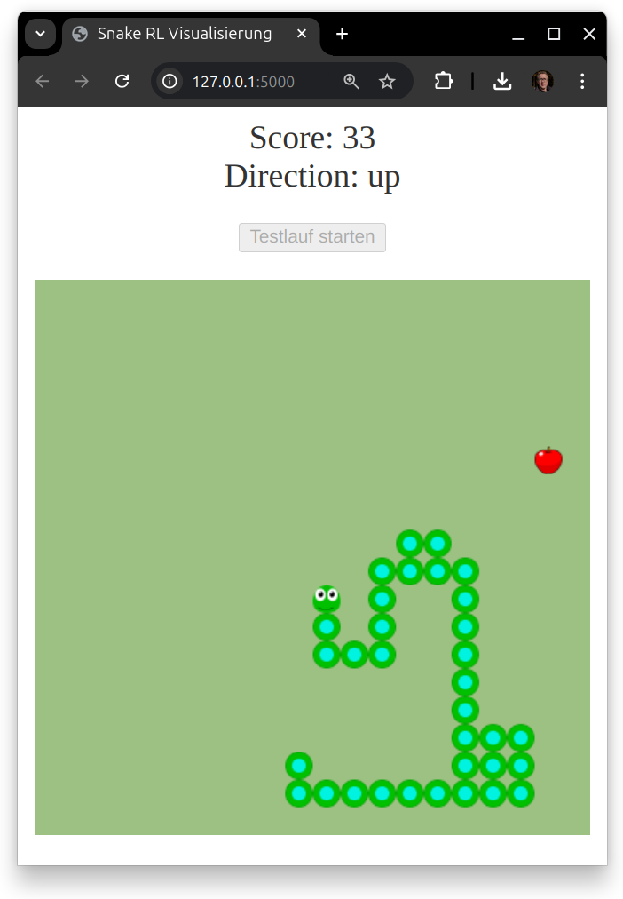

# Reinforcement-Learning-Snake

Dieses Projekt implementiert eine Snake-Umgebung gemäss dem OpenAI Gym Standard und trainiert einen Reinforcement Learning Agenten (PPO) mit stable-baselines3.

## Projektübersicht



Dieses Projekt besteht aus einer Snake-Umgebung, die mit Gymnasium erstellt wurde, und einem DQN-Agenten, der mit stable-baselines3 trainiert wird. Die Umgebung und der Agent werden verwendet, um das Verhalten der Schlange zu steuern und zu optimieren.

## Verzeichnisstruktur

```bash
assets/
    screenshot.png
models/
    ppo_snake.zip
src/
    templates/
        index.html
    static/
        apple_alt_64.png
        snake_green_blob_64.png
        snake_green_head_64.png
    app.py
    snake_env.py
    train.py
.gitignore
LICENSE
README.md
requirements.txt


```

- `app.py`: Startet eine Flask-Webanwendung zur Visualisierung des Snake-Spiels.
- `snake_env.py`: Implementiert die Snake-Umgebung gemäss dem Gym-Standard.
- `train.py`: Skript zum Trainieren des DQN-Agenten.
- `templates/index.html`: HTML-Datei für die Visualisierung des Spiels.
- `requirements.txt`: Liste der Python-Abhängigkeiten.
- `LICENSE`: Lizenzinformationen.
- `README.md`: Diese Datei.

## Installation

Optional: Erstelle und starte venv

```bash
sudo apt install python3.12-venv
python3 -m venv venv
source venv/bin/activate
```

Installiere requirements

```bash
pip install -r requirements.txt
```

## Training

Optional: Starte tensorboard (optional):

```bash
tensorboard --logdir=./tensorboard/
```

Starte das Training des PPO-Agenten mit:

```bash
python src/train.py
```

## Start Demo

Starte die Flask-Webanwendung zur Visualisierung des Spiels mit:

```bash
python src/app.py
```

## Nutzung

1. Öffne einen Webbrowser und gehe zu `http://127.0.0.1:5000/`.
2. Klicke auf den Button "Testlauf starten", um das Spiel zu starten.
3. Beobachte die Schlange, wie sie sich basierend auf dem trainierten Modell bewegt.

## Fehlerbehebung

- Stelle sicher, dass alle Abhängigkeiten korrekt installiert sind.
- Überprüfe, ob die Datei `ppo_snake.zip` im Verzeichnis vorhanden ist, bevor du die Demo startest.
- Bei Problemen mit Flask oder SocketIO, überprüfe die Versionen und Kompatibilität der Pakete in `requirements.txt`.

## Lizenz

Dieses Projekt steht unter der MIT-Lizenz. Siehe die [LICENSE](LICENSE) Datei für weitere Details.
